<!--
MI PERFIL · JUAN TORRES
Busca COMPLETAR para editar los espacios personales.
Guía de edición, imágenes y animaciones: PERSONALIZAR.md.
-->

<p align="center">
  
</p>

<h1 align="center">Hola, soy Juan Sebastián 😸</h1>

<p align="center">
  <b>Ingeniería de Sistemas de Información · UPC</b><br />
  Lima, Perú.
</p>

<p align="center">
  <a href="https://portafolio-juan-torres-puce.vercel.app"></a>
  <a href="https://www.linkedin.com/in/jstorressanchez/"></a>
  <a href="mailto:jstorres.xora@gmail.com"></a>
</p>

<br />

<p align="center"></p>

## Un poco de mí

Soy estudiante de **Ingeniería de Sistemas de Información** en la UPC. 
Me interesa bastante el desarrollo de software, el análisis de datos, la seguridad de la información y la IA aplicada. Manejo muchas herramientas de desarrollo, siempre aprendo nuevas, asi que para cualquier tipo de problema yo resuelvo.

Por aca comparto proyectos de la universidad, iniciativas personales y lo que voy aprendiendo al construirlos :D .

```yaml
juan:
  desde: Lima, Perú
  formación: Sistemas de Información · UPC
  intereses:
    - Desarrollo de software
    - Datos e inteligencia artificial
    - Seguridad de la información
```

## Hacia adonde apunto

<br />
- **Mi enfoque actual:** Estar siempre al día con las últimas tecnologías. Me gusta testear nuevos modelos de IA, armar arquitecturas con agentes y, en general, aprender constantemente.
- **Mi próxima meta:** Llevar mis habilidades de arquitectura e IA al siguiente nivel, construyendo un sistema que escale y resuelva un problema complejo en producción, con que aun me falta "la idea".
- **Me gustaría colaborar en:** Algún proyecto grande o de alto impacto. Siento que trabajar en equipo en algo importante te abre la mente, te da nuevas perspectivas y se aprende muchísimo viendo cómo piensan y resuelven problemas los demás.
<br />

## Cosas que he construido

<sub>Una selección de mis proyectos. Entra para ver el código y el contexto.</sub>

<br /><br />

<table>
  <tr>
    <td width="50%" valign="top">
      <a href="https://github.com/Juan2246/APP-ventas-XORA"></a>
      <p>Inventario, ventas y reportes para digitalizar la gestión de un negocio minorista.</p>
      <p><code>Python</code> <code>Flask</code> <code>SQLite</code></p>
      <p><a href="https://github.com/Juan2246/APP-ventas-XORA"><b>Explorar XoraMarket ↗</b></a></p>
      <details><summary>Mi aporte y aprendizajes</summary><p><b>Mi aporte:</b> [COMPLETAR]</p><p><b>Lo que aprendí:</b> [COMPLETAR]</p></details>
    </td>
    <td width="50%" valign="top">
      <a href="https://github.com/Juan2246/alquila-ya"></a>
      <p>API de alquiler de propiedades con autenticación, reservas y contratos.</p>
      <p><code>Java</code> <code>Spring Boot</code> <code>PostgreSQL</code></p>
      <p><a href="https://github.com/Juan2246/alquila-ya"><b>Explorar Alquila Ya ↗</b></a></p>
      <details><summary>Mi aporte y aprendizajes</summary><p><b>Mi aporte:</b> [COMPLETAR]</p><p><b>Lo que aprendí:</b> [COMPLETAR]</p></details>
    </td>
  </tr>
  <tr>
    <td width="50%" valign="top">
      <a href="https://github.com/Juan2246/Data-Science-Project"></a>
      <p>Notebook sobre herramientas de ciencia de datos y ejercicios de Python. Proyecto de IBM/Coursera.</p>
      <p><code>Python</code> <code>Jupyter Notebook</code></p>
      <p><a href="https://github.com/Juan2246/Data-Science-Project"><b>Abrir el notebook ↗</b></a></p>
      <details><summary>Mi aprendizaje</summary><p><b>Lo que aprendí:</b> [COMPLETAR]</p><p><b>Mi siguiente experimento:</b> [COMPLETAR]</p></details>
    </td>
    <td width="50%" valign="top">
      <a href="https://portafolio-juan-torres-puce.vercel.app"></a>
      <p>Un espacio para reunir mis proyectos, formación y recorrido en tecnología.</p>
      <p><code>Next.js</code> <code>TypeScript</code> <code>Tailwind CSS</code></p>
      <p><a href="https://portafolio-juan-torres-puce.vercel.app"><b>Visitar mi portafolio ↗</b></a></p>
      <details><summary>Detrás del diseño</summary><p><b>Mi detalle favorito:</b> [COMPLETAR]</p><p><b>Lo que quiero mejorar:</b> [COMPLETAR]</p></details>
    </td>
  </tr>
</table>

<p align="center"><a href="https://github.com/Juan2246?tab=repositories">Todos mis repositorios →</a></p>

<br />

## Herramientas

<sub>Algunas de las tecnologías que uso, presentes en mis proyectos y formación.</sub>

### Backend y datos


### Frontend


<br />


<br />

## Actividad en Github
<picture>
  <source media="(prefers-color-scheme: dark)" srcset="https://raw.githubusercontent.com/Juan2246/Juan2246/main/assets/contributions-dark.svg" />
  
</picture>

<picture>
  <source media="(prefers-color-scheme: dark)" srcset="https://raw.githubusercontent.com/Juan2246/Juan2246/main/assets/pacman-dark.svg" />
  
</picture>

<br />


</details>

<br />

---

<h3 align="center">Conversemos.</h3>

<p align="center">
  <a href="mailto:jstorres.xora@gmail.com">Correo</a> ·
  <a href="https://www.linkedin.com/in/jstorressanchez/">LinkedIn</a> ·
  <a href="https://portafolio-juan-torres-puce.vercel.app">Portafolio</a>
</p>

<br />


" />
