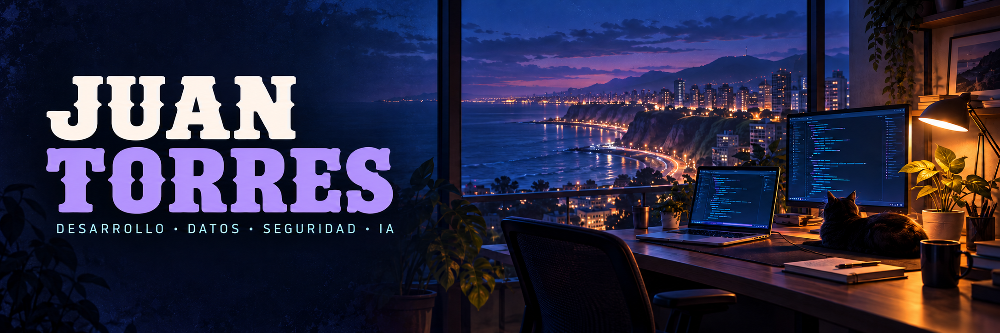

<p align="center">
  
</p>

<h1 align="center">
  
  <picture>
    <source media="(prefers-color-scheme: dark)" srcset="https://raw.githubusercontent.com/Juan2246/Juan2246/main/assets/headings/hello-dark.svg" />
    <source media="(prefers-color-scheme: light)" srcset="https://raw.githubusercontent.com/Juan2246/Juan2246/main/assets/headings/hello-light.svg" />
    
  </picture>
</h1>

<p align="center">
  <b>Ingeniería de Sistemas de Información · UPC</b><br />
  Lima, Perú.
</p>

<p align="center">
  <a href="https://portafolio-juan-torres-puce.vercel.app" title="Portafolio"></a>&nbsp;&nbsp;
  <a href="https://www.linkedin.com/in/jstorressanchez/" title="LinkedIn"></a>
  <a href="mailto:jstorres.xora@gmail.com" title="Correo"></a>
</p>

<h2>
  
  <picture>
    <source media="(prefers-color-scheme: dark)" srcset="https://raw.githubusercontent.com/Juan2246/Juan2246/main/assets/headings/about-dark.svg" />
    <source media="(prefers-color-scheme: light)" srcset="https://raw.githubusercontent.com/Juan2246/Juan2246/main/assets/headings/about-light.svg" />
    
  </picture>
</h2>

Soy estudiante de **Ingeniería de Sistemas de Información** en la UPC.

Me interesa bastante el desarrollo de software, el análisis de datos, la seguridad de la información y la IA aplicada. Manejo muchas herramientas de desarrollo y siempre aprendo nuevas, así que, para cualquier tipo de problema, yo resuelvo.

Por acá comparto proyectos de la universidad, iniciativas personales y lo que voy aprendiendo al construirlos. :D

```yaml
juan:
  desde: Lima, Perú
  formación: Sistemas de Información · UPC
  intereses:
    - Desarrollo de software
    - Datos e inteligencia artificial
    - Seguridad de la información
```

<h2>
  
  <picture>
    <source media="(prefers-color-scheme: dark)" srcset="https://raw.githubusercontent.com/Juan2246/Juan2246/main/assets/headings/goals-dark.svg" />
    <source media="(prefers-color-scheme: light)" srcset="https://raw.githubusercontent.com/Juan2246/Juan2246/main/assets/headings/goals-light.svg" />
    
  </picture>
</h2>

- **Mi enfoque actual:** Estar siempre al día con las últimas tecnologías. Me gusta testear nuevos modelos de IA, armar arquitecturas con agentes y, en general, aprender constantemente.
- **Mi próxima meta:** Llevar mis habilidades de arquitectura e IA al siguiente nivel, construyendo un sistema que escale y resuelva un problema complejo en producción, aunque aún me falta «la idea».
- **Me gustaría colaborar en:** Algún proyecto grande o de alto impacto. Siento que trabajar en equipo en algo importante te abre la mente, te da nuevas perspectivas y se aprende muchísimo viendo cómo piensan y resuelven problemas los demás.

<h2>
  
  <picture>
    <source media="(prefers-color-scheme: dark)" srcset="https://raw.githubusercontent.com/Juan2246/Juan2246/main/assets/headings/projects-dark.svg" />
    <source media="(prefers-color-scheme: light)" srcset="https://raw.githubusercontent.com/Juan2246/Juan2246/main/assets/headings/projects-light.svg" />
    
  </picture>
</h2>

Una selección de mis proyectos. Entra para ver el código y el contexto.

<table>
  <tr>
    <td width="50%" valign="top">
      <h3>
        
        <picture>
          <source media="(prefers-color-scheme: dark)" srcset="https://raw.githubusercontent.com/Juan2246/Juan2246/main/assets/headings/xora-dark.svg" />
    <source media="(prefers-color-scheme: light)" srcset="https://raw.githubusercontent.com/Juan2246/Juan2246/main/assets/headings/xora-light.svg" />
          
        </picture>
      </h3>
      <p>Inventario, ventas y reportes para digitalizar la gestión de un negocio minorista.</p>
      <p><code>Python</code> <code>Flask</code> <code>SQLite</code></p>
      <p><a href="https://github.com/Juan2246/APP-ventas-XORA"><b>Explorar XoraMarket →</b></a></p>
      <details><summary>Mi aporte y aprendizajes</summary><p><b>Mi aporte:</b> [COMPLETAR]</p><p><b>Lo que aprendí:</b> [COMPLETAR]</p></details>
    </td>
    <td width="50%" valign="top">
      <h3>
        
        <picture>
          <source media="(prefers-color-scheme: dark)" srcset="https://raw.githubusercontent.com/Juan2246/Juan2246/main/assets/headings/alquila-dark.svg" />
    <source media="(prefers-color-scheme: light)" srcset="https://raw.githubusercontent.com/Juan2246/Juan2246/main/assets/headings/alquila-light.svg" />
          
        </picture>
      </h3>
      <p>API de alquiler de propiedades con autenticación, reservas y contratos.</p>
      <p><code>Java</code> <code>Spring Boot</code> <code>PostgreSQL</code></p>
      <p><a href="https://github.com/Juan2246/alquila-ya"><b>Explorar Alquila Ya →</b></a></p>
      <details><summary>Mi aporte y aprendizajes</summary><p><b>Mi aporte:</b> [COMPLETAR]</p><p><b>Lo que aprendí:</b> [COMPLETAR]</p></details>
    </td>
  </tr>
  <tr>
    <td width="50%" valign="top">
      <h3>
        
        <picture>
          <source media="(prefers-color-scheme: dark)" srcset="https://raw.githubusercontent.com/Juan2246/Juan2246/main/assets/headings/data-dark.svg" />
    <source media="(prefers-color-scheme: light)" srcset="https://raw.githubusercontent.com/Juan2246/Juan2246/main/assets/headings/data-light.svg" />
          
        </picture>
      </h3>
      <p>Notebook sobre herramientas de ciencia de datos y ejercicios de Python. Proyecto de IBM/Coursera.</p>
      <p><code>Python</code> <code>Jupyter Notebook</code></p>
      <p><a href="https://github.com/Juan2246/Data-Science-Project"><b>Abrir el notebook →</b></a></p>
      <details><summary>Mi aprendizaje</summary><p><b>Lo que aprendí:</b> [COMPLETAR]</p><p><b>Mi siguiente experimento:</b> [COMPLETAR]</p></details>
    </td>
    <td width="50%" valign="top">
      <h3>
        
        <picture>
          <source media="(prefers-color-scheme: dark)" srcset="https://raw.githubusercontent.com/Juan2246/Juan2246/main/assets/headings/portfolio-dark.svg" />
    <source media="(prefers-color-scheme: light)" srcset="https://raw.githubusercontent.com/Juan2246/Juan2246/main/assets/headings/portfolio-light.svg" />
          
        </picture>
      </h3>
      <p>Un espacio para reunir mis proyectos, formación y recorrido en tecnología.</p>
      <p><code>Next.js</code> <code>TypeScript</code> <code>Tailwind CSS</code></p>
      <p><a href="https://portafolio-juan-torres-puce.vercel.app"><b>Visitar mi portafolio →</b></a></p>
      <details><summary>Detrás del diseño</summary><p><b>Mi detalle favorito:</b> [COMPLETAR]</p><p><b>Lo que quiero mejorar:</b> [COMPLETAR]</p></details>
    </td>
  </tr>
</table>

<p align="center"><a href="https://github.com/Juan2246?tab=repositories">Todos mis repositorios →</a></p>

<h2>
  
  <picture>
    <source media="(prefers-color-scheme: dark)" srcset="https://raw.githubusercontent.com/Juan2246/Juan2246/main/assets/headings/tools-dark.svg" />
    <source media="(prefers-color-scheme: light)" srcset="https://raw.githubusercontent.com/Juan2246/Juan2246/main/assets/headings/tools-light.svg" />
    
  </picture>
</h2>

Algunas de las tecnologías que uso, presentes en mis proyectos y formación.

<h3>
  
  <picture>
    <source media="(prefers-color-scheme: dark)" srcset="https://raw.githubusercontent.com/Juan2246/Juan2246/main/assets/headings/backend-dark.svg" />
    <source media="(prefers-color-scheme: light)" srcset="https://raw.githubusercontent.com/Juan2246/Juan2246/main/assets/headings/backend-light.svg" />
    
  </picture>
</h3>


<h3>
  
  <picture>
    <source media="(prefers-color-scheme: dark)" srcset="https://raw.githubusercontent.com/Juan2246/Juan2246/main/assets/headings/frontend-dark.svg" />
    <source media="(prefers-color-scheme: light)" srcset="https://raw.githubusercontent.com/Juan2246/Juan2246/main/assets/headings/frontend-light.svg" />
    
  </picture>
</h3>


<h2>
  
  <picture>
    <source media="(prefers-color-scheme: dark)" srcset="https://raw.githubusercontent.com/Juan2246/Juan2246/main/assets/headings/activity-dark.svg" />
    <source media="(prefers-color-scheme: light)" srcset="https://raw.githubusercontent.com/Juan2246/Juan2246/main/assets/headings/activity-light.svg" />
    
  </picture>
</h2>

<picture>
  <source media="(prefers-color-scheme: dark)" srcset="https://raw.githubusercontent.com/Juan2246/Juan2246/main/assets/contributions-dark.svg" />
  
</picture>

<picture>
  <source media="(prefers-color-scheme: dark)" srcset="https://raw.githubusercontent.com/Juan2246/Juan2246/main/assets/pacman-dark.svg" />
  
</picture>

---

<h2 align="center">
  
  <picture>
    <source media="(prefers-color-scheme: dark)" srcset="https://raw.githubusercontent.com/Juan2246/Juan2246/main/assets/headings/contact-dark.svg" />
    <source media="(prefers-color-scheme: light)" srcset="https://raw.githubusercontent.com/Juan2246/Juan2246/main/assets/headings/contact-light.svg" />
    
  </picture>
</h2>

<h2 align="center">
  <a href="mailto:jstorres.xora@gmail.com">Correo</a> ·
  <a href="https://www.linkedin.com/in/jstorressanchez/">LinkedIn</a>
</h2>


